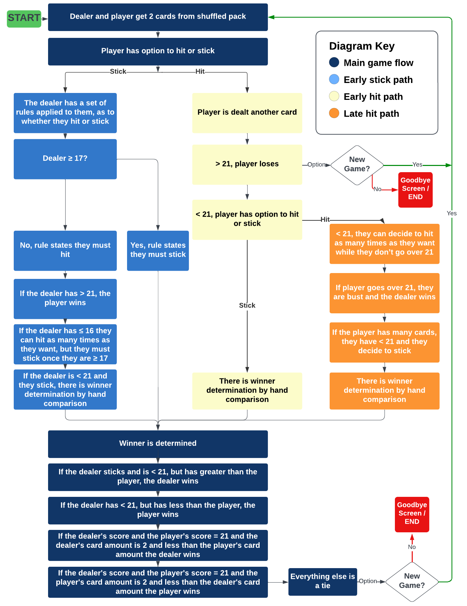

# Twenty One

(Developer: Katie Dunne)

## Live website

Link to live website: [Twenty One](https://twenty-one-ef5033cef47c.herokuapp.com/)

## Purpose of the project

Twenty One is a Python terminal game. The game of Twenty One is well known. It is also known as Black Jack. This game runs in the Code Institute mock terminal on Heroku. Traditionally, in a casino setting, the player would play against a dealer. This would be in a card game, table setting. In the case of this deployed game, the user is trying to beat the computer. The game built here is interactive and it provides feedback to the user as they play. All errors are handled and the user can seamlessly play again, without having to manually run the program from scratch.

## Table of contents

## User experience (UX)

### Key project goals

- Create an interactive card game in a terminal using Python
- The functionality of this game should keep the core concept of black jack. That is, playing a card game using shuffled cards, against a dealer and winning without busting over a score of 21
- Allow the user to seemlessly restart a game without having to manually press the run program button at the top of the page and without having to refresh the page

### Target audience

- Users that would like to entertain themselves by playing a fun card game online
- Users that like to play terminal based games

### User requirements and expectations

- An intuitive game interface
- An ability to read the rules of the game
- An ability to personalise the game by adding a name
- The ability to restart the game seemlessly in the terminal

## User stories

As a site visitor,

- I want to play a game
- I want to see the game title when I arrive on the start screen
- I want to see a start screen where next steps are intuitive
- I want to be able to find the rules of the game easily
- I want to be able to enter a username to make the game feel personal to me
- If I enter data that doesn't make sense to a particular step in the game I want to be informed
- I want to be able to restart the game easily once I have finished playing the first time

## Features

### Start screen

### Rules

### Win screen

### Lose screen

### Goodbye screen

### Restart game

### User personalisation

## Future features

### Betting System

### Split hand

An option to split your hands if you are dealt two of the same cards, this would make the logic of the game more complex

### Data analysis

Interaction with an API for example, google sheets.

### Hide one of dealers cards

## Design

### Flowcharts

## Data models

## Technology

### Language

- Python

### Frameworks & Tools

- [Lucid Chart](https://www.lucidchart.com/pages/)
- [Git](https://git-scm.com/)
- [GitHub](https://github.com/)
- [Visual Studio Code IDE](https://code.visualstudio.com/)
- [Prettier Code Formatter](https://prettier.io/)
- [Venngage's Accessible color palette generator](https://venngage.com/tools/accessible-color-palette-generator)

## Deployment

All code for this project was written in visual studio integrated development environment. Github was used for version control and the application was deployed to heroku from github.

### How this site was deployed on Heroku

After account setup, the steps were as follows:

- Click the "create new app" button on heroku
- Create a unique name for the app
- Select region (Europe was selected for this project)
- Click "create app"
- Go to settings tab
- Set config vars using the creds.json file. In the field for key, "CREDS" should be entered and in the field for value, the entire cred.json file content is entered
- Another key and value need to be added and these are, PORT and 8000, respectively
- Then click "add buildpack"
- Use python and nodejs buildpacks
- The buildpack order should be python on top and nodejs underneath
- Go to the deploy tab
- Select the deployment method (github was used for this project)
- Search for the github repository name (it was twenty_one for this project)
- Click connect
- There is an option to use manual deployment or automatic deployment. Make sure main branch is selected
- After the first deployment you will see a message saying "your app was successfully deployed" and there will be a "view" button to take you to your deployed application

The live link for this project can be found here - [Twenty One](https://twenty-one-ef5033cef47c.herokuapp.com/)

### This repository can be forked with the following steps:

- Go to the GitHub repository
- Click on the Fork button in the upper right-hand corner

### This repository can be cloned using the following steps:

- Go to the GitHub repository
- Click the Code button near the top of the page
- Select 'HTTPS', 'SSH', or 'Github CLI', depending on how you would like to clone
- Click the copy button to copy the URL to your clipboard
- Open Git Bash
- Change the current working directory to where you want the cloned directory
- Type git clone and paste the URL ($ git clone https://github.com/YOUR-USERNAME/YOUR-REPOSITORY)
- Press enter to create your clone locally

Note, the difference between clone and fork is: you need permissions to push back to the original from a clone, but not a fork because a fork will be completely your own new project.
