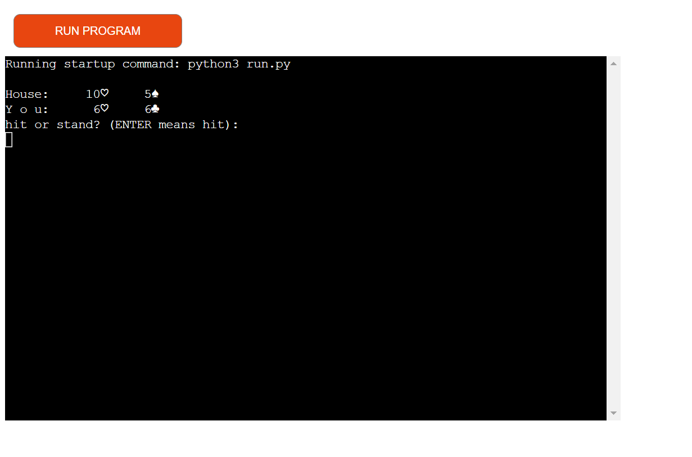

# Twenty One

(Developer: Katie Dunne)

## Live website

Link to live website: [Twenty One](https://twenty-one-ef5033cef47c.herokuapp.com/)

## Purpose of the project

Twenty One is a Python terminal game. The game of Twenty One is well known. It is also known as Black Jack. This game runs in the Code Institute mock terminal on Heroku. Traditionally, in a casino setting, the player would play against a dealer. This would be in a card game, table setting. In the case of this deployed game, the user is trying to beat the computer. The game built here is interactive and it provides feedback to the user as they play. All errors are handled and the user can seamlessly play again, without having to manually run the program from scratch.

## Table of contents

## Deployment

All code for this project was written in visual studio integrated development environment. Github was used for version control and the application was deployed to heroku from github.

### How this site was deployed on Heroku

After account setup, the steps were as follows:

- Click the "create new app" button on heroku
- Create a unique name for the app
- Select region (Europe was selected for this project)
- Click "create app"
- Go to settings tab
- Set config vars using the creds.json file. In the field for key, "CREDS" should be entered and in the field for value, the entire cred.json file content is entered
- Another key and value need to be added and these are, PORT and 8000, respectively
- Then click "add buildpack"
- Use python and nodejs buildpacks
- The buildpack order should be python on top and nodejs underneath
- Go to the deploy tab
- Select the deployment method. Github was used for this project
- Search for the github repository name. It was twenty_one for this project
- Click connect
- There is an option to use manual deployment or automatic deployment. Make sure main branch is selected
- After the first deployment you will see a message saying "your app was successfully deployed" and there will be a "view" button to take you to your deployed application

The live link for this project can be found here - [Twenty One](https://twenty-one-ef5033cef47c.herokuapp.com/)

### This repository can be forked with the following steps:

- Go to the GitHub repository
- Click on the Fork button in the upper right-hand corner
