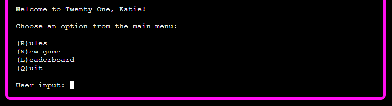
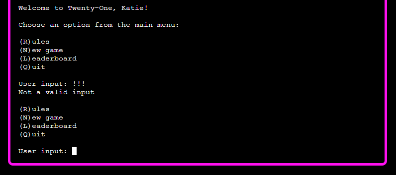
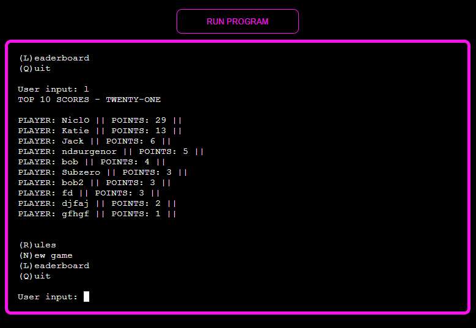
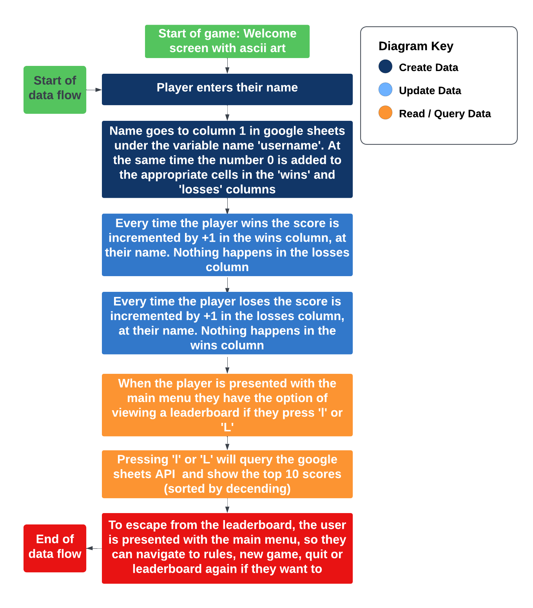

# Twenty One

(Developer: Katie Dunne)

## Live website

Link to live website: [Twenty One](https://twenty-one-ef5033cef47c.herokuapp.com/)

## Purpose of the project

Twenty One is a Python terminal game. The game of Twenty One is well known. It is also known as Black Jack. This game runs in the Code Institute mock terminal on Heroku. Traditionally, in a casino setting, the player would play against a dealer. This would be in a card game, table setting. In the case of this deployed game, the user is trying to beat the computer. The game built here is interactive and it provides feedback to the user as they play. All user input has validation functionality and the user can seamlessly play again, without having to manually run the program from scratch.

## Table of contents

## User experience (UX)

### Key project goals

- Create an interactive card game in a terminal using Python
- The functionality of this game should keep the core concept of black jack. That is, playing a card game using shuffled cards, against a dealer and winning without busting over a score of 21
- Allow the user to seemlessly restart a game without having to manually press the run program button at the top of the page and without having to refresh the page
- Allow the user to navigate the game with a main menu
- Write player wins and losses to Google Sheets. This data could be used by a card dealer or casino business to analyse and adjust the game (e.g. adding more decks to a shuffle is one way a casino can make a card game harder if the house is losing too much)
- Query win data to show the player a leaderboard

### Target audience

- Users that would like to entertain themselves by playing a fun card game online
- Users that like to play terminal based games

### User requirements and expectations

- An intuitive game interface
- An ability to personalise the game by adding a name
- The abilty to navigate around the game with a main menu
- An ability to read the rules of the game
- The ability to restart the game seemlessly in the terminal, after you have finished playing a game
- The ability to see a leaderboard with the stored number of wins, if the user chooses to see it from a main menu

## User stories

As a site visitor,

- I want to play a game
- I want to see the game title when I arrive on the start screen
- I want to see a start screen where next steps are intuitive
- I want to be able to enter a username to make the game feel personal to me
- If I enter data that doesn't make sense to a particular step in the game I want to be informed
- I want the abilty to navigate around the game with a main menu
- I want to be able to find the rules of the game easily
- I want to be able to restart the game easily once I have finished playing a game
- I want the ability to see a leaderboard with the stored number of wins, if I choose to see it from a main menu

## Features

### Start screen

Here the user will see ASCII art that displays 'WELCOME TO TWENTYONE'. The user will be prompted to enter their name. They are also told to use a fake name because the name they enter will be stored for game personalization. The name entered here is used to personalize the win message, the lose message and the goodbye screen. The name is also sent to Google sheets and the win or loss is updated at the appropriate time. This data can be queried via a leaderboard or analyzed by the card dealer.

#### Start screen image with ascii art and promt to add a name

### Main menu options

After the user enters their name. It is used in string formatting to welcome them to the game of Twenty-One. Then the user is asked to choose an option from the main menu. Here, the user is given the option to press r or R for rules, n or N for a new game, l or L to view the leaderboard and q or Q to quit. Every other character, number or special character shows the user a message saying, not a valid input.

### Input validation

User input validation is used is all parts of the game where a user must input something to continue the game. For example, see below - if the user enters special characters into the main menu input option, they will be told it is not a valid input.

### Rules

The rules function prints 5 basic rules of the game to the screen. The game presented here is a simple version of black jack and so it was renamed to twenty-one.

### Win screen

In the screenshot below the player chose to stand on 20 and the house had to stand on 17 therefore, the player won and a notification saying 'you win, (player name)' was shown.

In the screenshot below the house got a large number card and went over 21. The house bust. A notification then appears displaying 'house bust, you win (player name)'.

### Lose screen

In the screenshot below the player chose to stand on 18 and then the house got 19 and won, so a you lose screen appeared. This screen displays 'you lose, (player name)'.

### Goodbye screen

The personalised goodbye notification appears when the player choses q or Q, from the main menu.

### Restart game

Below is a screenshot of the option to restart the game. It is a yes or no question.

### User personalisation

Below are 2 screenshot of an examples of where user personalization is used in the game. It is used more often than this, these are just examples. The first one shows that when the user enters a name, the name entered is used in a welcome message.

All game notification and the goodbye message is personalised, please see the example below.

### Clear terminal output for a new game or restart game

Below is a screenshot of how the screen clears at certain times to make the user experience less confusing and fun to use. In the screenshot below all terminal output was cleared right after the user clicked n or N for new game in the main menu. It also clears when the user presses y or Y for the 'play another game?' question.

### Leaderboard

When l or L is chosen from the main menu. A leaderboard with the top 10 scores is displayed. It is sorted from highest to lowest score. A user can quit the game and come back another time and their wins will still increment appropriately if they have used the exact same name for the game.

### Graceful exit

It was noticed during manual texting that if you click Ctrl+c mid game, an error was shown on the screen and it is not very nice for UX. Therefore a graceful exit feature was added to the application where if at any stage that the app is open Ctrl+c is press, a message appears telling the user that they have pressed Ctrl+c and the game is now exiting. Pressing q from the main menu is another was to exit the game. That one will then display 'goodbye, (player name)' The first sceen shot shown below shows a greceful exit mid game.

This second screenshot shows a graceful exit when the user presses Ctrl+c when the main menu is displayed.

## Future features

### Betting system

When researching for this project I noticed that some other students managed to add a betting system to their black jack game. This is a fun feature and if time allowed I would have added it also.

### Split hand

An option to split your hands if you are dealt two of the same cards, this would make the logic of the game more complex. This would also make the game more realistic as this is an option when playing in a real life casino.

### Data analysis

Wins and losses could be analysed and when the house / business is losing too much an extra set of cards can be added to the shuffle. This is a real life way that a casino business can make their game more difficult for the player.

### Hide one of dealers cards

Hiding one of the dealers cards is again a feature which would make the game more like the traditional real life game of black jack.

### A running total

A running total of the numerical value that the house and the player have, which is displayed beside the 'dealt cards' would add a lot to the UX. This is a feature that would have been added if time allowed. However, the mvp is still fun to play without this feature. There was also the challenge of what to display if the ace was dealt, because it is the player's decision how they would like to treat the ace. That is whether they want to play it as a 1 or 11.

### A defensive question included in the graceful exit

The following question could be added to the graceful exit 'Ctrl-c was pressed. Do you really want to exit? y/n'. Then only stop the app if the user replys yes they are sure they want to exit.

## Design

### Design Choices

Since I built a card game, I was inspired by the nightlife and casino scene. So, I decided to go for a neon color and I found that pink on black had high accessibilty. I originally tried green on black, but the contrast wasn't as high as I would have liked. Therefore, I settled on bight pink and black with white text. I was always keeping high contrast and accessibility in mind. The pink on black colors have a fun and energised feel, which I wanted to convey since it is a simple game that should encourage fun feelings.

### Typography

For the typography the arial font family with ligatures turned off, is used in the code institute mock terminal template. This design was maintained.

### Centered mock terminal

I didn't do too much with the styling in this project, because I didn't want to take away from the fact that this is a python based project. The only alterations I made to the style was that; I centered the mock terminal, I hid the vertical scroll bar and I gave it a bright pink and black theme.

### Flow Charts

#### Core game flowchart

A core game flow chart was designed to help with writing the game functionality. See below.

#### Data flowchart

There is create, read and update data functionality built into this game. Error handling for the google sheets api is also build in to the run file so that the game is still playable even if the call to google sheets fails.

## Technology

### Language

- Python

### Frameworks & Tools

- [Heroku](https://www.heroku.com/)
- [Git](https://git-scm.com/)
- [GitHub](https://github.com/)
- [Visual Studio Code IDE](https://code.visualstudio.com/)
- [Lucid Chart](https://www.lucidchart.com/pages/)
- [Prettier Code Formatter](https://prettier.io/)
- [Chrome DevTools](https://developer.chrome.com/docs/devtools/)
- [Google Lighthouse](https://chrome.google.com/webstore/detail/lighthouse/blipmdconlkpinefehnmjammfjpmpbjk)
- [Perplexity AI](https://www.perplexity.ai/) Note: AI was used for rule text content, not code. It was also only used for inspiration, the output was not copied directly into the project without being altered for my own need
- Code institute's template for the mock terminal was used, but it was styled by centering it, hiding the scroll bar and giving it a pink and black theme

The query used for Perplexity AI was as follows: "Write the 8 most important rules of blackjack card game using bulletpoints". Five rules were taken from the output and altered to suit this game of twenty one.

### Python libraries

- [random](https://docs.python.org/3/library/random.html) was imported for shuffling the deck
- [signal](https://docs.python.org/3/library/signal.html) was imported for the graceful exit
- [sys](https://docs.python.org/3/library/sys.html) was imported for setting the terminal text color
- [os](https://docs.python.org/3/library/os.html) was used to import system function in order to clear the terminal output right before a new game starts

### Third party python modules that were imported and used

- [gspread](https://docs.gspread.org/en/v5.11.3/) was imported and this is a library of code which is used to access and update data in the spreadsheet
- [google.oauth2.service_account](https://google-auth.readthedocs.io/en/master/reference/google.oauth2.service_account.html) was used to authorize the connection with the Google Sheets API. The leaderboard data was stored here.
- [pyfiglet](https://pypi.org/project/pyfiglet/) was imported to render ascii art

### Multiple python files

There are 4 python files in total, with run.py being the main python file. The other 3 files are imported and their functions called in run.py

- 'spreadsheets' is a file.py that I added to this project and the worksheet function is used in run.py
- 'rules' is a file.py that I added to this project, the print_rules function is imported and used in run.py
- 'messages' is a file.py that I added to this project, and it contains notification constants, the notification function and the clear function

## Testing

### Code validation

#### PEP8 validation

PEP 8 is a style guide for Python code.

The result was all clear, no errors found, when I put the 'run' file code through the CI Python Linter.

The result was all clear, no errors found, when I put the 'messages' file code through the CI Python Linter.

The result was all clear, no errors found, when I put the 'rules' file code through the CI Python Linter.

The result was all clear, no errors found, when I put the 'spreadsheets' file code through the CI Python Linter.

### Accessibility and Lighthouse

Using a pink on black color theme brought the accessibility score up to 100. Accessibility was previously at 94 when using the green on black color theme.

### Manual testing

#### Browser compatibility testing

- The app was tested on the following browsers, Chrome, Firefox, Edge, Safari and Opera

- The app was tested for 'intended appearance' and for 'intended functionality' on all 5 browsers

- From what I can see the app works exactly the same on all 5 browsers

- Note: The app was also tested on a 2012 macbook air, because I find app-faults usually show up easily on older devices, it was tested on a 2017 macbook and a 2022 microsoft windows PC

- See browser compatibility testing results in the table below

| browser compatibility | chrome | edge | firefox | safari | opera |
| --------------------- | ------ | ---- | ------- | ------ | ----- |
| intended appearance   | pass   | pass | pass    | pass   | pass  |
| functionality         | pass   | pass | pass    | pass   | pass  |

### User story testing

#### User story testing table

|     | User Story                                                                                                     | Testing                                                                                                                                           |
| --- | -------------------------------------------------------------------------------------------------------------- | ------------------------------------------------------------------------------------------------------------------------------------------------- |
| 1   | I want to play a game                                                                                          | The opening screen has the word game on it. Also Twenty One is a well known alternative name to Black Jack so it is intuitive that this is a game |
| 2   | I want to see the game title when I arrive on the start screen                                                 | This need has been met                                                                                                                            |
| 3   | I want to see a start screen where next steps are intuitive                                                    | This need has been met, the player is asked to enter a name                                                                                       |
| 4   | I want to be able to enter a username to make the game feel personal to me                                     | This need has been met                                                                                                                            |
| 5   | If I enter data that doesn't make sense to a particular step in the game I want to be informed                 | This need has been met, the phrase 'not a valid input' has been implimented in all places where user input is required                            |
| 6   | I want the abilty to navigate around the game with a main menu                                                 | This need has been met                                                                                                                            |
| 7   | I want to be able to find the rules of the game easily                                                         | This need has been met, the rules can be accessed from the main menu or mid game play                                                             |
| 8   | I want to be able to restart the game easily once I have finished playing a game                               | This need has been met, there is a question asking if the user wants to play another game after gameplay ends                                     |
| 9   | I want the ability to see a leaderboard with the stored number of wins, if I choose to see it from a main menu | This need has been met                                                                                                                            |

#### User story testing screenshots

##### User stories 1, 2, 3 and 4

- I want to play a game

- I want to see the game title when I arrive on the start screen

- I want to see a start screen where next steps are intuitive

- I want to be able to enter a username to make the game feel personal to me

Screenshot

    

##### User story 5

- If I enter data that doesn't make sense to a particular step in the game I want to be informed

Screenshots

    
    

##### User story 6

- I want the abilty to navigate around the game with a main menu

Screenshot

    

##### User story 7

- I want to be able to find the rules of the game easily

Screenshots

    
    

##### User story 8

- I want to be able to restart the game easily once I have finished playing a game

Screenshot

    

##### User story 9

- I want the ability to see a leaderboard with the stored number of wins, if I choose to see it from a main menu

Screenshots

    
    

### Fixed bugs

#### Input validation rules bug

See a screenshot of the 'input validation rules bug' below. The line 'Not a valid input' is displaying at the bottom of the rules and it shouldn't be there. The problem was that I wrote 'if' in the main menu function, where there should have been an 'elif' and this broke the conditional logic of the whole function. It especially broke the logic for after r or R was selected for rules. This is why 'Not a valid input' displayed, as it was the next line of code that was read.

See screenshot below the fix for this was simply changing 'if' answer in {"l", "L"}:, to 'elif' answer in {"l", "L"}:.

#### Input validation game play bug

It can be seen in the screenshot below that if a number was added during game play it was caught, and 'Not a valid input' was displayed. However, if a number was entered a second time it was not caught and the game kept playing.

The reason for this bug was that when the input validation catches the first invalid input it broke out of the while loop so another while loop needed to be added at the end of this code block. See the fix for this in the screenshot below.

#### Graceful exit

It was noticed during manual testing that if the user pressed Ctrl+c during game play an error was displayed to the user. This is not good UX. So I decided to add a graceful exit for when Ctrl+C was pressed at any time when the app was running. Please see screenshot below for how the error looked before the graceful exit was added.

This was fixed by importing the signal module and adding the handler function to run.py. Then calling that as the first function in the main function.

#### Capital H bug

During manual testing of the app, I noticed that capital H would not deal cards and after a while I noticed that I was allowing the word 'hit' instead of a capital H in a while loop. This was fixed by simply changing the word hit to an uppercase H.

### Unfixed bugs

No unfixed bugs

### Supported browsers

- Chrome
- Edge
- Firefox
- Safari
- Opera

## Deployment

All code for this project was written in visual studio integrated development environment. Github was used for version control and the application was deployed to heroku from github.

### How this site was deployed on Heroku

After account setup, the steps were as follows:

- Click the "create new app" button on heroku
- Create a unique name for the app
- Select region (Europe was selected for this project)
- Click "create app"
- Go to settings tab
- Set config vars using the creds.json file. In the field for key, "CREDS" should be entered and in the field for value, the entire cred.json file content is entered
- Another key and value need to be added and these are, PORT and 8000, respectively
- Then click "add buildpack"
- Use python and nodejs buildpacks
- The buildpack order should be python on top and nodejs underneath
- Go to the deploy tab
- Select the deployment method (github was used for this project)
- Search for the github repository name (it was twenty_one for this project)
- Click connect
- There is an option to use manual deployment or automatic deployment. Make sure main branch is selected
- After the first deployment you will see a message saying "your app was successfully deployed" and there will be a "view" button to take you to your deployed application

The live link for this project can be found here - [Twenty One](https://twenty-one-ef5033cef47c.herokuapp.com/)

### This repository can be forked with the following steps:

- Go to the GitHub repository
- Click on the Fork button in the upper right-hand corner

### This repository can be cloned using the following steps:

- Go to the GitHub repository
- Click the Code button near the top of the page
- Select 'HTTPS', 'SSH', or 'Github CLI', depending on how you would like to clone
- Click the copy button to copy the URL to your clipboard
- Open Git Bash
- Change the current working directory to where you want the cloned directory
- Type git clone and paste the URL ($ git clone https://github.com/YOUR-USERNAME/YOUR-REPOSITORY)
- Press enter to create your clone locally

Note, the difference between clone and fork is: you need permissions to push back to the original from a clone, but not a fork because a fork will be completely your own new project.

## Credits

### Code

[Function to show scoreboard](https://github.com/adrianskelton/project3/blob/main/run.py#L138) - Function to show scoreboard was adapted from code in this project

[Graceful exit](https://code-maven.com/catch-control-c-in-python) - The code for the graceful exit was adapted from this tutorial

[Colored output to the terminal in python](https://stackoverflow.com/questions/37340049/how-do-i-print-colored-output-to-the-terminal-in-python) - The output was originally going to be green but this wasn't good for accessibility so the output was changed to white using the number 97

[White color in terminal](https://github.com/pwaller/pyfiglet/blob/main/pyfiglet/__init__.py#L53) - It can be seen where the number 97 came from at this link

[The argument attributes of exceptions](https://stackoverflow.com/questions/4308182/getting-the-exception-value-in-python) - I learned how to get the 'exception as e' from this link

[CI student black jack 1](https://github.com/kpsdev1/blackjack/blob/main/run.py) - The notification function which uses pyfiglet was adapted from code in this CI student's project

[CI student black jack 2](https://github.com/luizsmania/blackjack/blob/main/run.py#L49C1-L59C28) - The function for clearing the terminal was adapted from code in this CI student's project

[Love sandwiches code institute walk through](https://github.com/Code-Institute-Solutions/love-sandwiches-p5-sourcecode/blob/master/01-getting-set-up/02-connecting-oto-our-api-with-python/run.py) - Code altered from code institute love sandwiches project, to get twenty one spreadsheet

### Inspiration for black jack game from other CI students

[CI student black jack game 1](https://python-blackjack.herokuapp.com/)

[CI student black jack game 2](https://blackjack-10.herokuapp.com/)

### Black jack rules

[Black jack background from wikipedia](https://en.wikipedia.org/wiki/Blackjack)

[Black jack rules from bicycle cards](https://bicyclecards.com/how-to-play/blackjack)

[Black jack rules from black jack apprenticeship](https://www.blackjackapprenticeship.com/blackjack-strategy-charts/)

[Black jack rules from wikihow](https://www.wikihow.com/Play-Blackjack)

[Black jack rules from casino alpha player guides](https://casinoalpha.com/player-guides/blackjack-rules/)

## Acknowledgements

Thank you to family and friends for the continued support and inspiration. Thank you to my CI mentor and to the leader of our CI cohort :sparkles:
